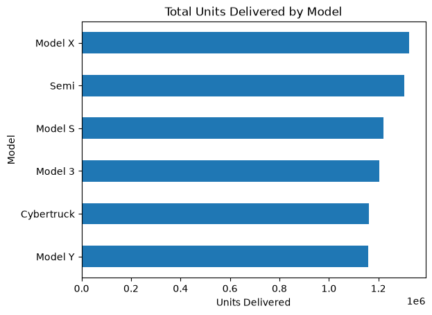
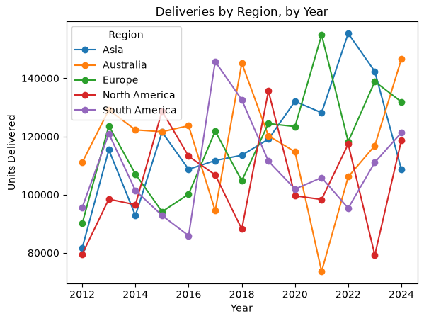
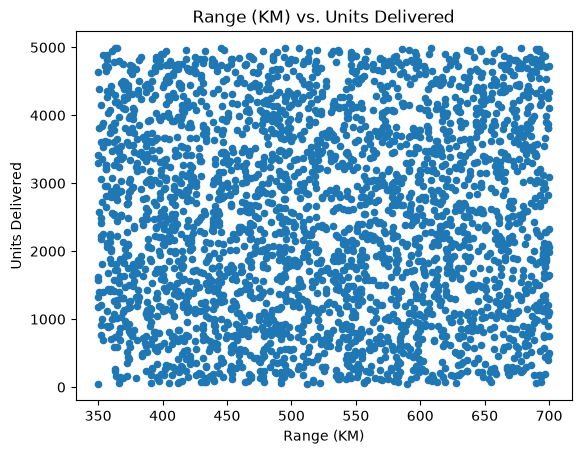
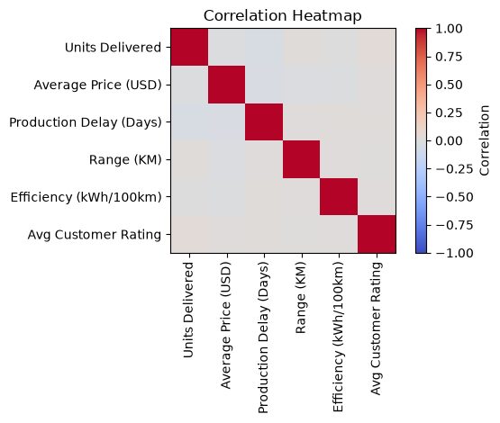

# Tesla Deliveries Dashboard

A case study analyzing Tesla (NASDAQ: TSLA) vehicle deliveries, written for **Alpha Kappa Psi's Fall 2026 Rush — Case Study #2: Business Analytics & AI**. The assignment asks three tiers of questions — data-fundamentals, applied analysis, and strategy — and this project answers all of them twice, using the same dataset: once in **Python (pandas + matplotlib)**, once in **Excel (formulas + native charts)**.

Both versions are written to be **followed line-by-line, not just read** — plain `groupby`s and `.corr()` in Python, plain `SUM`/`AVERAGE`/`SUMIF`/`VLOOKUP`/`CORREL` in Excel, no regression models, no custom styling, no nested tiering logic. The goal was to make every step legible enough that someone newer to data analysis could open either file and understand *why* each line is there, not just *what* it outputs.

**⚠️ Analytical limitations, upfront:** the Kaggle source labels this dataset "realistic synthetic data for data science projects" — **not** Tesla's actual reported figures. Nothing here should be cited as Tesla's real historical deliveries, revenue, or market share; the value is in practicing the analytical techniques the case study asks for.

---

## The case study, and how it was answered

**Level 1 — Data fundamentals**
- *Why does data cleaning matter?* The dataset has no missing values or duplicate rows, but a simple business-logic check — comparing each row's `Year` against a lookup table of each model's real launch year — catches something a null-check alone would miss: rows showing Cybertruck and Semi deliveries years before those vehicles existed. That's the case for cleaning being more than "check for blanks."
- *How do you choose the right chart?* Answered by building each type once, on purpose: bar chart, line chart, histogram, scatter plot, and a correlation heatmap — see the charts below.
- *Why do dashboards help decision-making?* The Excel workbook's KPI Summary and Regional Growth sheets are the answer in practice — a handful of numbers a manager can scan in seconds, defined once and reused everywhere downstream.

**Level 2 — Applied analysis**
- *Top 3 models by delivery volume?* `Model X`, `Semi`, and `Model S` lead in this dataset (see the bar chart below) — though the spread across all six models is narrow, which turns out to matter for the next question.
- *Can historical data point to which region will grow fastest?* Rather than a black-box model, each region's first year in the data is compared to its last — a transparent trend read anyone can double-check by hand.
- *Does vehicle range predict delivery volume?* No — the correlation between `Range (KM)` and `Units Delivered` is essentially zero (see the scatter plot below). Delivery volume tracks more with *which model and region* a vehicle belongs to than with its spec sheet.

**Level 3 — Strategy**
- *What would a supply chain manager do with this?* Combining the regional growth read with average production delay per region surfaces a single actionable flag — 🚀 EXPAND, ⚠️ FIX SUPPLY CHAIN, 🛑 AT RISK, or 👀 MONITOR — so the recommendation is "look at this region first," not just "delays are up."

---

## A few of the charts (from `tesla_case_study.ipynb`)

**Level 2 Q1 — Top models by delivery volume**



**Level 2 Q2 — Regional growth trend**



**Level 2 Q3 — Does range predict demand? (it doesn't)**



**Level 1 Q2 — One view of every numeric relationship at once**



The notebook has three more charts (a line chart, a histogram, and a top-3-models trend line) and renders fully on GitHub — every chart is saved directly in `tesla_case_study.ipynb`, so browsing to the file shows the full analysis with no extra setup.

---

## Approach 1: Python Notebook (`tesla_case_study.ipynb`)

**Techniques used:**
- Data cleaning via a `VLOOKUP`-style dictionary map, checking real-world launch years against the data
- One chart type per cell — bar, line, histogram, scatter, heatmap — each tied to the question it answers
- `groupby` + `.corr()` for model/region rankings and range-vs-volume correlation
- A first-year-vs-last-year growth comparison per region, in place of a trained model
- A rule-based recommendation combining growth and delay into one flag per region

**Run it:**
```bash
python3 -m venv venv
source venv/bin/activate
pip install -r requirements.txt
```

Run local:
```bash
source venv/bin/activate
jupyter notebook tesla_case_study.ipynb
```

Or
```
Open in Visual Studio Code as a notebook, use venv as the kernel,
then Run or Restart All
```

Or open directly in [Google Colab](https://colab.research.google.com/) and upload the notebook + CSV.

---

## Approach 2: Excel Workbook (`Tesla_Deliveries_Dashboard.xlsx`)

The same analysis, rebuilt natively in Excel — no Python, no macros, everything formula-driven so it recalculates live if the source data changes.

**Techniques used:**
- `SUM` / `AVERAGE` / `SUMIF` / `SUMIFS` / `AVERAGEIF` — a KPI summary and per-model, per-region, per-year breakdowns
- `VLOOKUP` against a small reference table — the same launch-year data-cleaning check as the notebook
- `CORREL` — testing range and efficiency against delivery volume
- Plain `IF` / `AND` logic (compared against `AVERAGE()`, not `RANK` or regression) for the region recommendation flag
- Native Excel bar and line charts built straight from the formula tables

**Open it:** just open `Tesla_Deliveries_Dashboard.xlsx` in Excel, Google Sheets, or LibreOffice Calc — no setup required. Start on the **README** tab.

---

## Repo structure

```
tesla-deliveries-dashboard/
├── README.md
├── tesla_case_study.ipynb          # Python / pandas / matplotlib version
├── Tesla_Deliveries_Dashboard.xlsx # Excel formulas / native charts version
├── tesla_vehicle_deliveries.csv    # source data
├── requirements.txt
└── docs/                           # chart images used in this README
```

## Region recommendation logic (prototype, both versions)

| Flag | Criteria |
|---|---|
| 🚀 **EXPAND** | Above-average growth **and** below-average production delay |
| ⚠️ **FIX SUPPLY CHAIN** | Above-average growth **and** above-average production delay |
| 🛑 **AT RISK** | Below-average growth **and** above-average production delay |
| 👀 **MONITOR** | Everything else |

> An illustrative rule-based prototype for this exercise — not Tesla's actual supply-chain methodology.

## Data source

[Tesla Vehicle Deliveries Dataset (2012-2024)](https://www.kaggle.com/datasets/khushikyad001/tesla-vehicle-deliveries-dataset-20122024) (Kaggle) — labeled realistic synthetic data, 3,000 rows × 24 columns.
